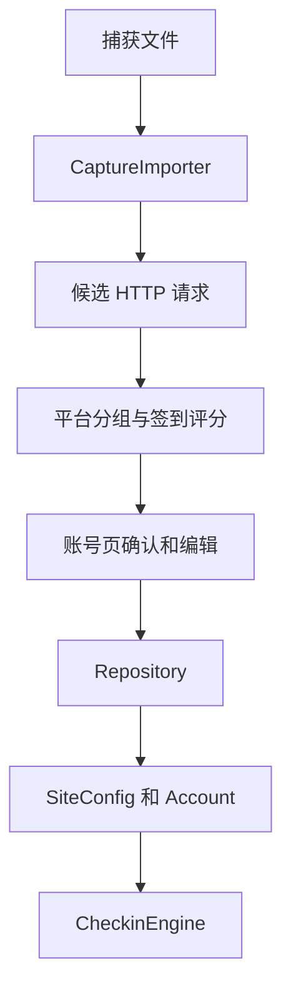

# 系统架构

## 概述

daily-auto-checkin 是一款 Android 本地应用。用户可维护站点和账号凭据，按计划执行 HTTP 签到请求，并查看执行日志。站点、账号和设置保存于应用的 SharedPreferences。

V1.1 新增从用户主动选择的 HAR、cURL、Postman、Insomnia、OpenAPI、PCAP 或 PCAPNG 文件中生成可编辑签到配置的流程。应用仅解析本地文件中的可见 HTTP 数据；TLS 加密的原始捕获文件会提示用户从源工具导出已解密的 HAR 或 cURL。

## 技术栈

- Kotlin 与 Android SDK 34
- AndroidX Fragment、RecyclerView、WorkManager
- Material Components 与 View Binding
- OkHttp 执行签到 HTTP 请求
- GitHub Actions 构建 Debug 与 Release APK

## 项目结构

```text
app/src/main/java/com/autocheckin/daily/
  core/     调度、服务与任务执行
  data/     SharedPreferences 存储、站点、账号、捕获导入
  net/      OkHttp 签到请求执行
  ui/       首页、站点、账号、日志界面
app/src/main/res/  布局、菜单与资源
```

## 关键流程


