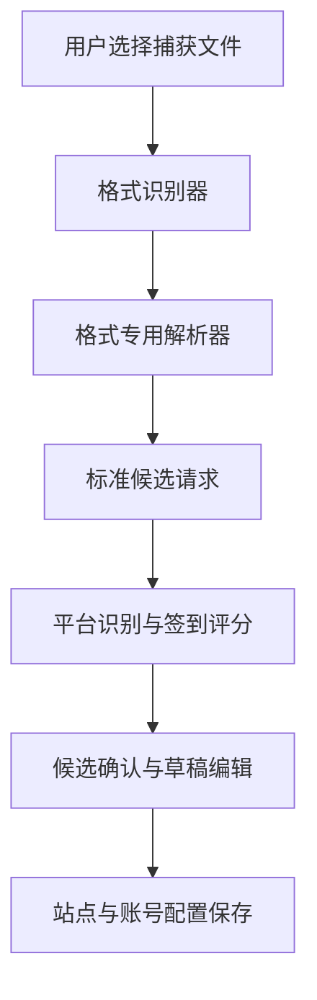

# Capture Import Design

Feature Name: capture-import
Updated: 2026-08-13

## Description

该功能扩展现有账号页的文件导入能力，新增独立的“从抓包文件生成签到配置”流程。流程将解析出的 HTTP 请求统一为内部模型，按平台归组并推荐可能的签到请求，用户确认后写入现有 `SiteConfig` 与 `Account` 存储。

## Architecture



格式识别按魔数、内容 JSON 结构与扩展名依次判断。每个解析器只负责将源数据转换为 `CapturedRequest`；平台识别器只消费标准请求模型，从而支持后续增加导入格式。

## Components and Interfaces

### CaptureImportFragment

提供格式说明、系统文件选择、解析进度、警告信息、平台分组、请求选择和草稿确认入口。文件选择 MIME 类型包含 JSON、纯文本与二进制捕获文件类型。

### CaptureFormatDetector

接口为 `detect(bytes, filename): CaptureFormat`。支持 HAR、cURL、Postman Collection、Insomnia Export、OpenAPI、PCAP 与 PCAPNG。检测失败时返回可理解的格式错误。

### CaptureParser

接口为 `parse(input): ParseResult`。`ParseResult` 包含 `requests`、`warnings` 与 `unparsedCount`。实现包括：

- `HarParser`
- `CurlParser`
- `PostmanCollectionParser`
- `InsomniaExportParser`
- `OpenApiParser`
- `PcapParser`
- `PcapNgParser`

PCAP 与 PCAPNG 解析器只读取文件内可见的 HTTP 明文会话。TLS 记录只生成“需要解密导出”的警告，不进入请求还原流程。

### PlatformClassifier

接口为 `classify(requests): List<PlatformGroup>`。分组键使用注册域名，展示名优先取 HAR 页面标题、Postman Collection 名称或域名。评分输入包括域名、路径片段、方法、参数名、响应状态、响应 JSON 字段和正文关键词。评分输出必须附带可展示的匹配依据。

### CheckinDraftBuilder

将用户选择的 `CapturedRequest` 转换为 `SiteConfig` 草稿和 `Account` 草稿。将识别出的 Cookie、Authorization 和 token 类字段替换为 `{{token}}`，用户在确认页选择保留的凭据内容。成功规则优先采用响应 JSON 中明确的 code、success、message 字段；缺少稳定响应模式时以待确认草稿形式呈现。

## Data Models

```kotlin
data class CapturedRequest(
    val url: String,
    val method: String,
    val headers: Map<String, String>,
    val body: String,
    val statusCode: Int?,
    val responseBody: String?,
    val sourceLabel: String
)

data class PlatformGroup(
    val key: String,
    val displayName: String,
    val requests: List<ScoredRequest>,
    val evidence: List<String>
)

data class ScoredRequest(
    val request: CapturedRequest,
    val score: Int,
    val evidence: List<String>
)
```

`CapturedRequest` 保持导入源信息，`SiteConfig.CheckinConfig` 保持可执行请求模板，`Account` 保持单个账号凭据。保存前将敏感字段从请求模板移入账号模型，避免在列表预览中明文展示凭据。

## Correctness Properties

- 每个解析器生成的 URL 与方法必须能映射到源请求。
- 在未获得可见 HTTP 内容时，导入结果只能包含说明性警告，不生成可执行签到配置。
- 平台推荐只能排序候选请求，保存操作必须由用户选择请求和确认草稿触发。
- 生成的请求模板必须与现有 `CheckinEngine` 的 URL、方法、headers、body、`{{token}}` 占位符兼容。
- 对同一输入重复解析应产生等价的候选请求与排序结果。

## Error Handling

- 文件格式未知：说明支持格式并保留重新选择入口。
- JSON 结构损坏：显示解析位置与来源格式。
- PCAP 缺少 HTTP 明文：显示 TLS 解密准备步骤和 HAR/cURL 替代导出方式。
- 解析文件过大：显示大小限制和建议导出单个目标会话。
- 候选请求缺少 URL 或方法：计入未解析项目并展示数量。
- 凭据字段无法自动归类：以掩码字段显示，由用户决定是否绑定到 `{{token}}`。

## Test Strategy

- 为每种格式提供最小有效样本、缺少字段样本和包含敏感字段样本。
- 验证格式探测在扩展名错误时依然通过内容结构识别 JSON 格式。
- 验证 HAR、cURL、Postman 和 Insomnia 请求到 `CapturedRequest` 的字段映射。
- 验证 PCAP 与 PCAPNG 的 HTTP 明文会话提取和 TLS 警告。
- 验证平台分组、签到评分和匹配依据的稳定性。
- 验证草稿中的凭据被替换为 `{{token}}`，并可通过现有 `CheckinEngine` 正确渲染请求。
- 验证界面对加密 PCAP、空文件、损坏 JSON 和无候选请求的错误提示。

## References

[^1]: `app/src/main/java/com/autocheckin/daily/data/SiteConfig.kt#L6` - 当前站点签到配置模型。
[^2]: `app/src/main/java/com/autocheckin/daily/net/CheckinEngine.kt#L28` - 当前签到请求执行与模板替换逻辑。
[^3]: `app/src/main/java/com/autocheckin/daily/ui/AccountsFragment.kt#L30` - 当前 Android 文件导入导出入口。
