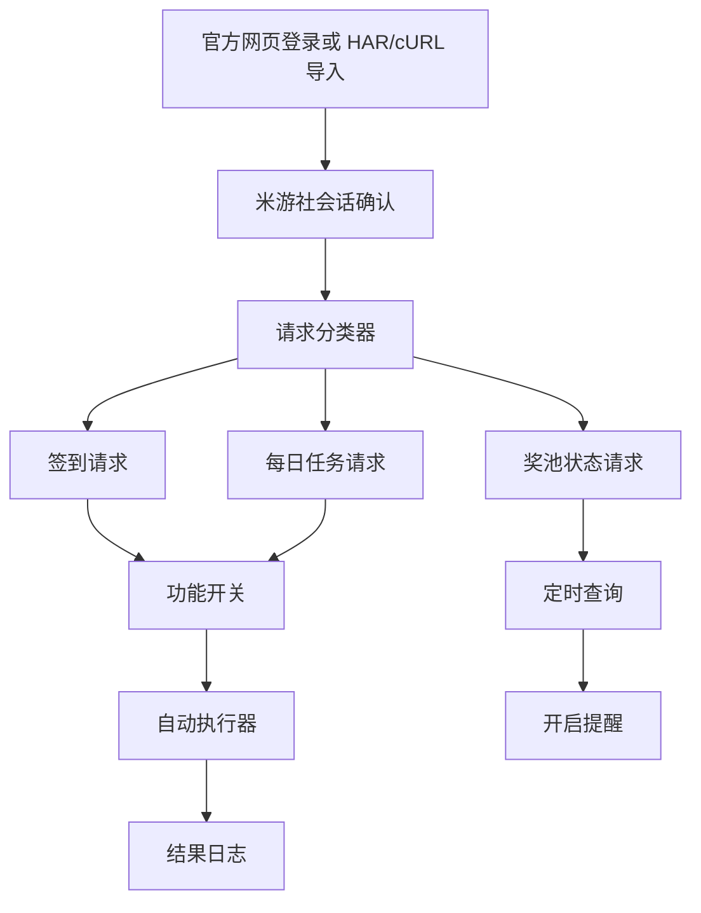

# 米游社签到与每日任务设计

Feature Name: miyoushe-checkin
Updated: 2026-08-13

## Description

本功能在现有站点、账号、签到执行和日志能力之上增加米游社专用的任务编排层。导入器或官方网页登录只负责获得用户确认的会话；请求识别器将签到、任务和奖池查询整理为可编辑请求；执行器依据功能开关自动执行识别出的请求，并在周期结束后汇总正常、异常和未执行状态。

验证码、拼图、滑块、设备确认和风控处理采用人工续期流程。系统检测到对应响应后停止自动请求，用户在官方页面完成验证后重新导入或确认新的会话。

## Architecture



请求分类器只使用用户导入或用户确认的请求，按照 URL 路径、请求方法、参数名称、响应字段和任务文本生成候选项。分类结果必须显示依据；用户确认来源和开启对应功能开关后，请求进入自动执行队列。

## Components and Interfaces

### MiyousheSessionProvider

提供两种会话来源：`ImportedCaptureSessionProvider` 读取 HAR/cURL 中的用户确认字段；`OfficialWebSessionProvider` 保存官方网页登录后用户确认的会话摘要。两种来源统一输出 `MiyousheSession`。

### MiyousheRequestCatalog

将现有 `CapturedRequest` 转换为 `MiyousheActionDraft`，动作类型包括 `CHECK_IN`、`DAILY_TASK`、`REWARD_CLAIM` 和 `LOTTERY_POOL_STATUS`。每个草稿包含请求用途、域名、方法、URL、脱敏请求头、请求体和识别依据。

### MiyousheActionExecutor

复用现有 `CheckinEngine` 的 HTTP 超时、模板替换和响应处理模式，新增动作分类开关、米游社域名确认、会话失效识别和人工验证识别。每次执行只接受已确认来源且对应开关开启的草稿。遇到验证时跳过当前动作并继续其他动作。

### MiyousheRunSummary

执行周期结束后生成 `COMPLETED`、`ABNORMAL`、`SKIPPED` 三类状态汇总。异常汇总提供批量选择、重试和取消重试操作；重试只提交用户选择的异常动作。

### LotteryPoolReminderWorker

使用 WorkManager 按用户配置查询奖池状态，保存上次状态，检测关闭到开启的变化并发出本地通知。查询遇到人工验证、登录失效或风控响应时暂停该来源。

## Data Models

```kotlin
data class MiyousheSession(
    val accountId: String,
    val headers: Map<String, String>,
    val cookies: String,
    val source: String,
    val confirmedAt: Long
)

enum class MiyousheActionType {
    CHECK_IN, DAILY_TASK, REWARD_CLAIM, LOTTERY_POOL_STATUS
}

data class MiyousheActionDraft(
    val id: String,
    val accountId: String,
    val type: MiyousheActionType,
    val name: String,
    val url: String,
    val method: String,
    val headers: Map<String, String>,
    val body: String,
    val evidence: List<String>,
    val confirmed: Boolean
)

data class MiyousheFeatureSwitches(
    val checkInEnabled: Boolean,
    val dailyTaskEnabled: Boolean,
    val rewardClaimEnabled: Boolean,
    val lotteryStatusEnabled: Boolean
)

enum class MiyousheActionStatus { COMPLETED, ABNORMAL, SKIPPED }

data class MiyousheRunSummary(
    val completed: List<String>,
    val abnormal: List<String>,
    val skipped: List<String>
)
```

会话凭据沿用现有账号存储边界，日志只保存账号标识、动作类型、结果和脱敏摘要。抽奖提醒配置保存查询草稿 ID、启用状态和查询时间表。

## Correctness Properties

- 未确认来源的动作草稿不能进入执行器。
- 关闭的功能开关对应的动作必须进入 `SKIPPED` 状态。
- 每个自动执行周期必须为每个识别动作生成且仅生成一个最终状态。
- 重试操作只能提交用户选择的 `ABNORMAL` 动作。
- 每次执行只能访问用户确认草稿中声明的域名和请求用途。
- 识别到人工验证、会话失效或风控响应后，当前动作进入 `ABNORMAL`，后续独立动作继续执行。
- 奖池提醒只在状态从关闭变为开启时发送一次通知，重复查询保持幂等。
- 日志中的 Cookie、Authorization、Token、账号凭据和响应敏感字段始终经过掩码。
- 会话删除后，关联动作草稿、提醒配置和执行入口都不可继续使用。

## Error Handling

- 官方登录取消：保留原账号状态并提示重新登录。
- HAR/cURL 没有米游社域名：显示候选来源并要求用户重新选择。
- 会话过期：记录认证失效并引导官方登录或重新导入。
- 人工验证：跳过当前动作并标记异常，提示用户在官方页面完成验证。
- 未知任务请求：创建待确认草稿并显示完整匹配依据。
- 奖池状态解析失败：记录响应状态与解析原因，等待下一次计划查询。

## Test Strategy

- 测试 HAR/cURL 会话提取、敏感字段掩码和米游社域名筛选。
- 测试签到、每日任务、奖励领取和奖池状态的动作分类。
- 测试功能开关、正常完成、异常跳过和未执行状态的分类。
- 测试人工验证响应进入异常并继续其他动作。
- 测试异常任务汇总、选择性重试和取消重试。
- 测试会话失效、重复签到和任务已完成响应的日志分类。
- 测试奖池关闭到开启的单次通知和重复查询幂等性。
- 测试账号删除后的动作、提醒和日志关联清理。

## References

[^1]: `app/src/main/java/com/autocheckin/daily/data/CaptureImport.kt` - 当前捕获文件解析、平台分类和草稿生成。
[^2]: `app/src/main/java/com/autocheckin/daily/net/CheckinEngine.kt` - 当前 HTTP 签到执行器。
[^3]: `app/src/main/java/com/autocheckin/daily/data/Repository.kt` - 当前站点、账号、设置和日志存储。
