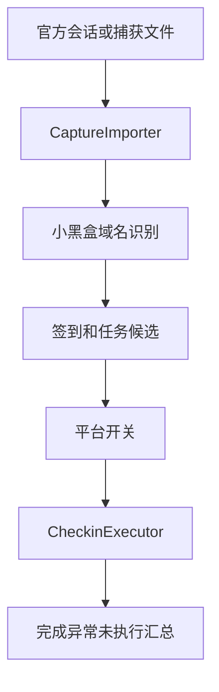

# 小黑盒签到与任务设计

Feature Name: xiaoheihe-checkin
Updated: 2026-08-13

## Description

小黑盒使用现有捕获文件解析器和 `SiteConfig` 执行模型。由于平台接口和活动请求会随版本变化，应用不内置未经确认的真实业务接口；用户从官方页面导入并确认请求后，系统将请求保存为小黑盒自定义站点配置。

## Architecture

## Components and Interfaces

- `CaptureImporter`: 识别 `xiaoheihe.com`、`heybox` 及小黑盒相关域名并提升平台匹配分数。
- `AccountsFragment`: 展示小黑盒候选请求、凭据掩码、请求编辑和保存入口。
- `Repository`: 保存小黑盒自定义站点、账号和开关。
- `CheckinExecutor`: 按平台开关过滤已启用小黑盒站点，并复用现有 HTTP 执行链路。

## Data Models

小黑盒请求转换为现有 `CapturedRequest`、`SiteConfig` 和 `Account`。平台 ID 使用 `xiaoheihe`，实际 URL、请求头、请求体和成功规则来自用户确认的官方请求。

## Correctness Properties

- 小黑盒平台识别只依据捕获请求中的实际域名和可展示匹配依据。
- 未确认的小黑盒请求不会保存为可执行配置。
- 关闭小黑盒开关时，对应站点不会进入自动执行队列。
- 敏感会话字段在预览和日志中保持掩码。

## Error Handling

- 未发现小黑盒域名时显示重新导出 HAR/cURL 的说明。
- HTTPS 原始 PCAP 无可读内容时提示 TLS 解密和官方导出步骤。
- 验证、登录失效和风控响应进入异常状态，并保留重试依据。

## Test Strategy

- 测试小黑盒域名识别和请求评分。
- 测试小黑盒请求保存为自定义站点。
- 测试会话字段掩码和 URL 缺失错误。
- 测试 Debug、Release 和单元测试构建。
