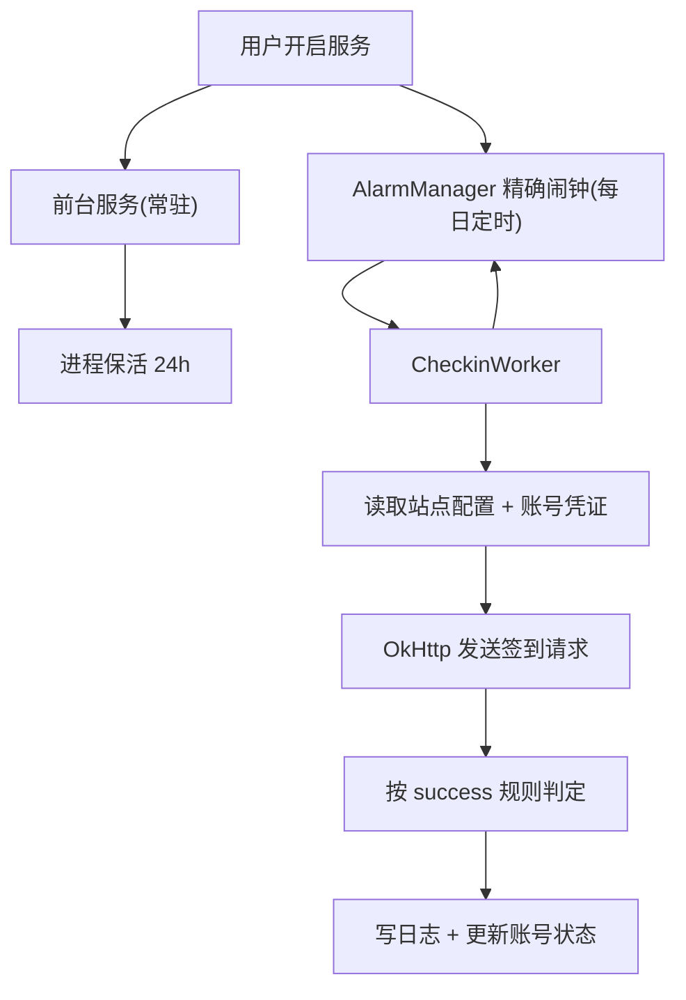

# AutoCheckin · 通用可配置自动签到 App

一款 **Android 通用可配置签到 App**：内置「禁漫天堂」「NoyAcg」占位模板，支持自定义任意站点的签到请求；UI 控制运行，前台服务保证 **App 关闭/划掉后仍持续后台运行**，可挂载在星界链云手机等 Android 环境上 **24 小时不间断自动签到**。

## 特性

- **通用可配置**：签到请求（URL / Method / Headers / Body / 成功判定）全部由 JSON 驱动，无需改代码即可适配任意站点
- **多账号**：每个站点可添加多个账号，各自独立凭证（Cookie/Token），互不影响
- **24 小时后台运行**：
  - 前台服务（Foreground Service）+ 常驻通知，App 被划掉/关闭后继续运行
  - 开机自启（BOOT_COMPLETED）与升级后自动恢复（MY_PACKAGE_REPLACED）
  - AlarmManager 精确闹钟在设定时间触发签到，进程被杀也会自动拉起
- **每日定时 + 当日去重**：按设定时间自动签，同一天同一账号不会重复签
- **UI 控制**：总览（开关/定时/立即签到）、账号、站点、日志四个页面
- **完整日志**：每次签到的时间、站点、账号、成功/失败与原因

## 运行原理



## 工程结构

```
.
├── app/src/main/java/com/autocheckin/daily/
│   ├── core/        # 前台服务、闹钟调度、Worker、开机自启、签到执行器
│   ├── data/        # 站点配置/账号/日志模型与本地存储
│   ├── net/         # OkHttp 签到引擎 + 成功判定
│   └── ui/          # 总览/账号/站点/日志 四个页面
├── app/src/main/assets/sites.json   # 内置站点模板（禁漫、NoyAcg）
├── docs/
│   ├── PACKET_CAPTURE_GUIDE.md      # 抓包教学（含禁漫/NoyAcg 要点）
│   └── SITES_CONFIG.md              # 站点配置 JSON 字段说明
└── .github/workflows/build-apk.yml  # GitHub Actions 自动编译 APK
```

## 在 GitHub 上编译 APK

推送到 GitHub 后，`Actions` 页会自动触发 **Build APK** 工作流，编译出 Debug 与 Release 两个通用 APK。每个 APK 均覆盖 `armeabi-v7a`、`arm64-v8a`、`x86`、`x86_64` CPU 架构；Release APK 使用开发者证书签名，可直接安装：

1. 进入仓库的 **Actions** 标签页，确认「Build APK」工作流运行成功
2. 打开运行记录，在 **Artifacts** 下载 `app-universal-debug-apk` / `app-universal-release-apk`
3. 将 APK 安装到星界链云手机或任意 Android 设备

> 也可以直接用 Android Studio 打开工程点 Run，或本机执行 `./gradlew :app:assembleDebug`。
> 需要 JDK 17 + Android SDK 34。

## 使用步骤

完整的从零使用流程、站点管理和配置备份说明见 [用户使用说明](docs/USER_GUIDE.md)。

1. **（可选）按 `docs/PACKET_CAPTURE_GUIDE.md` 抓包**，拿到目标站点真实签到请求
2. 打开 App →「站点」页：编辑内置站点或新增自定义站点，填入抓到的 URL/Headers/Body（凭证写成 `{{token}}`）
3. 「账号」页：选择站点，点右下角 `+` 添加账号，填入名称与该账号的真实凭证
4. 「总览」页：开启「后台自动签到服务」→ 开启「每日定时签到」→ 设置签到时间 → 点「立即签到」验证
5. 在「日志」页确认签到结果

## 常见问题

| 问题 | 处理 |
| --- | --- |
| 抓不到 HTTPS 请求 | 见 `docs/PACKET_CAPTURE_GUIDE.md` 第 6 节（证书问题） |
| 签到总是失败 | 去日志页看具体原因；多数是 URL/Headers 与真实请求不一致或凭证过期 |
| 接口带动态签名 | 该类接口静态配置无法自动计算签名，见抓包文档第 6 节 |
| 系统「强制停止」App | Android 限制：强制停止后后台任务会停，重新打开 App 即恢复 |
| 定时不准确 | 部分 ROM 有省电优化，首次使用建议在系统设置里给本 App 关闭电池优化 |

## 合规声明

本工具仅用于**自己账号**的个人定时签到。请勿用于批量注册、刷量、伪造互动等灰产或违法用途；不得用于抓取/存储他人数据。目标站点接口随时可能变更，本项目不保证任何站点长期可用。
